# The LOTI Simulation Model and Example

> This document was the project's original `README.md`. It describes the OMNeT++/INET
> simulation model and the results of the bundled example. For the theory behind the
> system see [theory.md](theory.md), for how the code implements it see
> [implementation.md](implementation.md), and for the gap between the two see
> [paper-vs-implementation.md](paper-vs-implementation.md).

## What's this Project?

This project implements the peer-to-peer partial event ordering network described in
[the original paper](https://docs.google.com/document/d/1KmdknFYkGlxhLoKOQb9g14LW4Jg7zIReaa_GsB5aJio)
(a local copy is in [Peer-to-peer Non-Consensus Partial Event Ordering Network.pdf](Peer-to-peer%20Non-Consensus%20Partial%20Event%20Ordering%20Network.pdf)), also written by me. The project uses a
well-known C++ discrete event communication network simulator
[OMNeT++ 5.4](https://omnetpp.org) and its most widely used model catalog
[INET 4.0](https://inet.omnetpp.org).

## What's in the Simulation Model?

The simulation model consists of three application models: the publisher, the browser
and the daemon. The project also contains an example simulation to demonstrate the
operation of the simulation model, and to provide some meaningful statistics.

### What Does the Publisher Application Do?

The publisher application represents an actor that is publishing digital data on the
Internet. Basically, it creates digital events periodically with some randomly generated
content. Both the creation interval and the content length are parameters of the
application, and they can be specified using distributions. The generated events are
passed to the daemon application running in the same node for including their hash in the
event graph. The utilized hashing algorithm is SHA256.

### What Does the Browser Application Do?

The browser application starts a discovery periodically using the daemon. The daemon
provides three different kinds of discoveries: the event chain discovery, the event
bounds discovery, and the event order discovery. The event chain discovery results in the
event chain starting from, and ending at a local clock event, and passing through the
event in question. The event bounds discovery results in the smallest upper bound
(simulation time) and the greatest lower bound (simulation time) for the event in
question. The event order discovery takes two events, and it results in the order between
the two: smaller (-1), greater (+1), or undefined (0).

The browser randomly chooses one (two for ordering) existing event among all events
generated by all nodes. In a real world example, the events would be provided by web
servers, or by some other means. The discovery interval, similarly to the above, is a
parameter of the application. When the discovery is completed, the browser application
displays the results to the user.

### What Does the Daemon Application Do?

The daemon application periodically creates clock events with local timestamps. Each new
clock event contains a reference to the last local clock event of the same node, and to
the last known clock event of all neighbors, and to all not yet referenced local events.

The daemon application sends the hash (only) of each new clock event to each neighbor
daemon. This type of packet is called the clock event notification. All communication
between daemons uses UDP packets.

When an event chain discovery is requested, the daemon applications in the network work
together to find out the short event chain that includes the requested event. The result
is then passed back to the application, or processed internally if used by other kinds of
discoveries.

The event chain discovery uses two types of packets, a discovery request, and a discovery
response. Both types are forwarded recursively along the overlay routing on the
peer-to-peer network using the shortest path towards the destination. The event discovery
response packets collect the event chain on their way back to the originator. Each
intermediate node extends the event chain with local events at both the lower and upper
bounds. Intermediate nodes take care of providing enough local clock events for the next
neighbor to allow it to continue the discovery.

All completed event chain discoveries end with validating the event chain by the discovery
originator. Validation includes verifying the hash of all events in the chain, verifying
that each event references the previous event in the chain, verifying that the chain
includes the originally requested event, and finally verifying that the first and last
events are locally created events. Event chain discovery results are only used after the
validation process is completed successfully.

All event bounds discovery is carried out by an event chain discovery, but this could be
more sophisticated. For example, several event chain discoveries could be started to
provide tighter results, to be more fault tolerant, to be redundant, etc.

Moreover, all event order discoveries are carried out by starting two distinct event chain
discoveries, one for each event. The result is determined by comparing the two chains, if
the two chains can be merged into one coherent chain using the local events, then the
order is determined. There cannot be any other chain which proves otherwise, because it
would actually break the hash algorithm by forming a full circle.

Finally, all discoveries expire after a configurable amount of time.

## What Statistics Does the Simulation Collect?

In OMNeT++, statistics can be collected in three forms: scalar, histogram and vector data.

Each daemon collects several statistics during the simulation:
 - Size of local event database
 - Size of local clock event database
 - Number of started/aborted/completed event chain discoveries
 - Number of started/aborted/completed event bounds discoveries
 - Number of started/aborted/completed event order discoveries
 - etc.

Additionally, for completed event chain discoveries each daemon collects the following:
 - Total simulation time to complete the discovery. This includes all packet exchanges and processing.
 - Length of the event chain. This is the sum of the length of the lower and upper bound for the requested event.
 - Local time interval of the event bounds. This is the difference between the timestamps of the first and last events in the chain.
 - Event ordering of event order discoveries.
 - etc.

Finally, INET collects several other statistics by default. For example, UDP collects:
 - Total number of packets sent
 - Total amount of data sent
 - etc.

## What's in the Example Simulation?

The included simple example uses a handcrafted homogenous network where each node runs all
three applications. The network contains 57 nodes connected with 1Gbps Ethernet links with
1us delay. The network topology is the following:

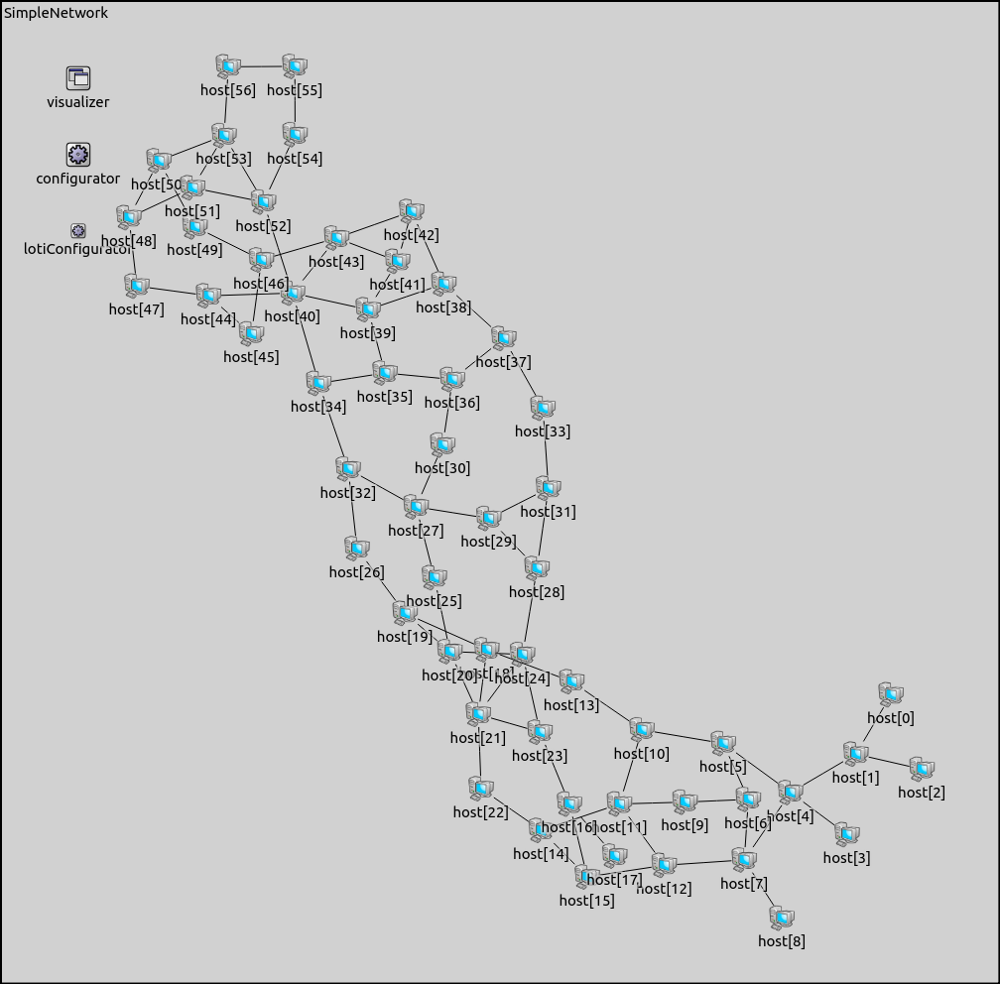

The network is automatically configured statically. Each network interface in each node
has an assigned static IPv4 address, and all routing tables contain static IPv4 routes
using the shortest path towards all destinations. This configuration is provided upon
request by INET.

Moreover, since the peer to peer network is an overlay network, all daemons are configured
to know their neighbors and the next hop neighbor towards all destinations. This overlay
would be useful for more realistic simulations where neighbors are not directly connected,
that is they are not on the same LAN. This second layer configuration is provided by LOTI.

All daemons generate clock events approximately every 1s, all publishers generate events
every 10s on average, and all browsers start a new discovery every 10s on average. The
rest of the parameters are as follows:

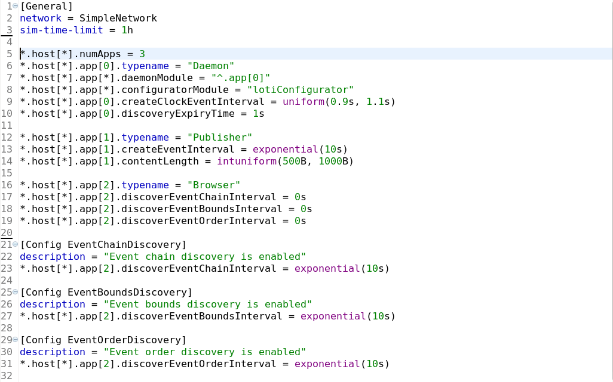

The network is simulated for 1 hour and on my computer the simulation completes under 1
minute.

## What are the Results?

The following charts summarize the statistical results collected during running the above
simulation.

The first chart shows how the per node clock event file grows over time. In 1 hour it
grows to 800,000B, so one event is roughly 220B, and thus one day would require ~20MB
storage space.

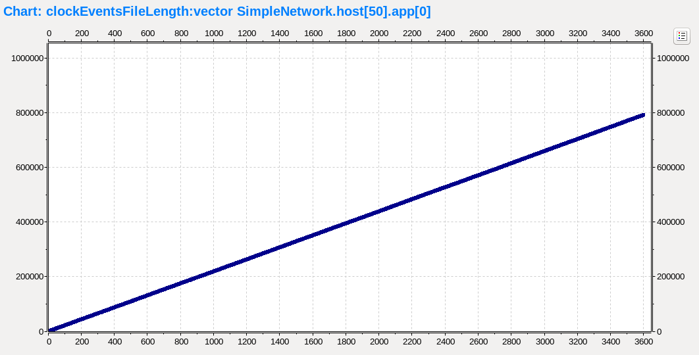

The next chart shows how the per node event file grows over time. This chart doesn't
include the actual content of the events, which in this simulation was set to be short
anyway to avoid unnecessary computations during hashing. Each publisher generates ~360
events, so the event overhead (excluding data) is ~100B per event.

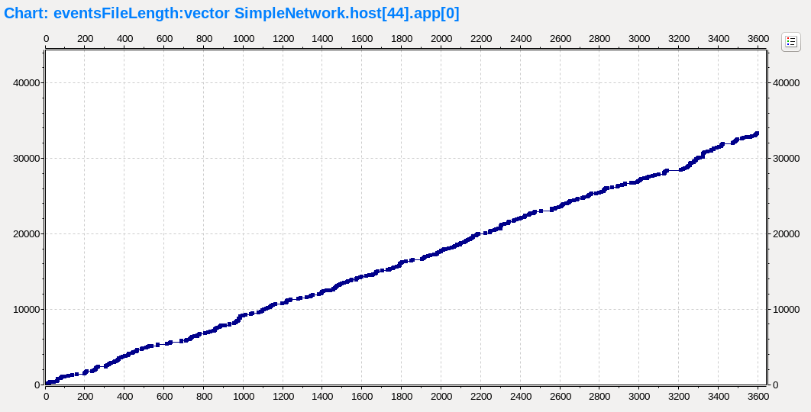

This chart shows various total counters for the whole network:

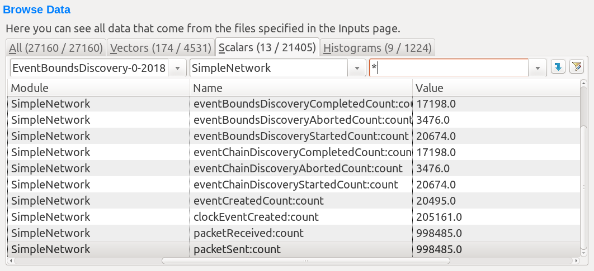

The total number of generated events is ~20,000, and the total number of generated clock
events is ~200,000:

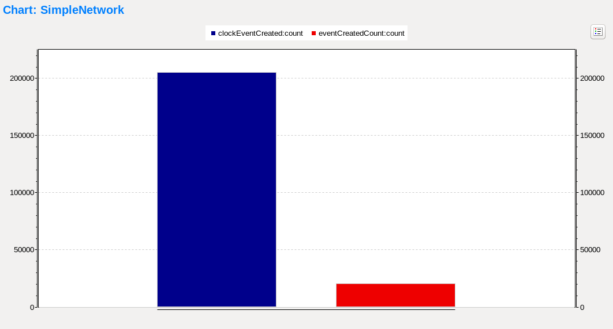

It's also worth showing the number of started, aborted and completed event bounds
discoveries separately:

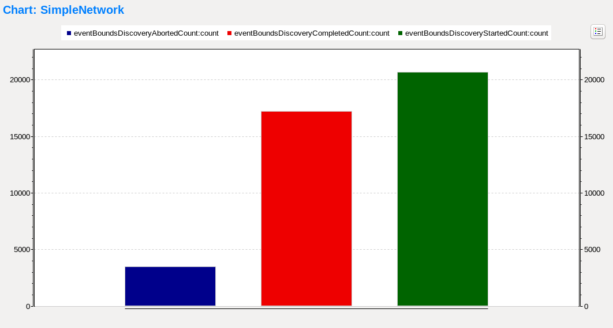

Approximately 83% of all event bounds discoveries were completed successfully, which also
means that the corresponding event chain is valid at the discovery originator. Discoveries
may fail due to expiry, for example. But there are more subtle reasons: the first and the
last few events often can't be tracked back to the clock event chain of the discovery
originator because there was not enough time for the links to be formed.

The next chart shows the histogram of the simulation time needed to complete the event
bounds discoveries for all nodes:

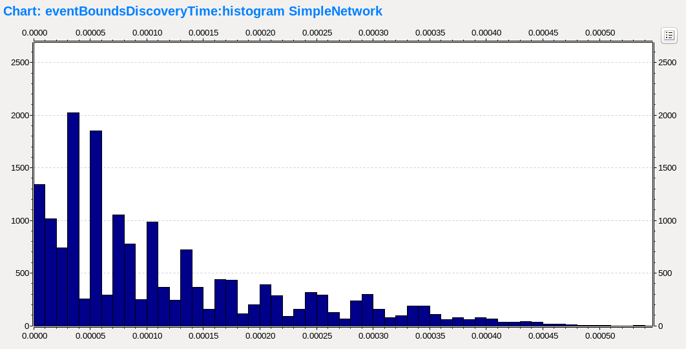

The following chart shows the time difference between the resulting local upper and local
lower bounds of each event discovery that were carried out by a selected node:

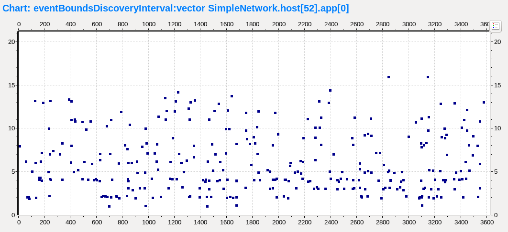

This chart shows the histogram of the difference between the resulting local upper and
local lower bounds of each event bounds discovery in the network:

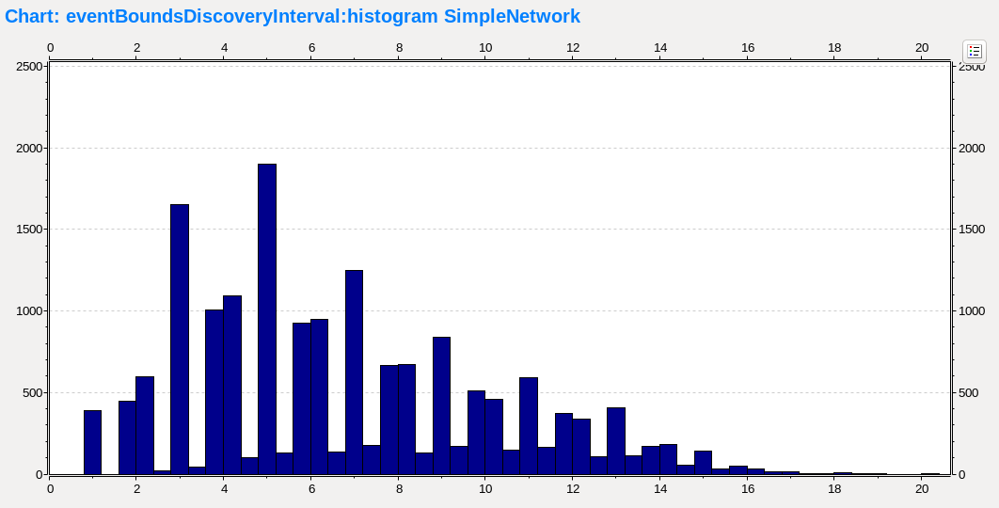

The underlying event chain discoveries may also be interesting. This chart shows the
histogram of the length of the resulting event chains of each event chain discoveries in
the network:

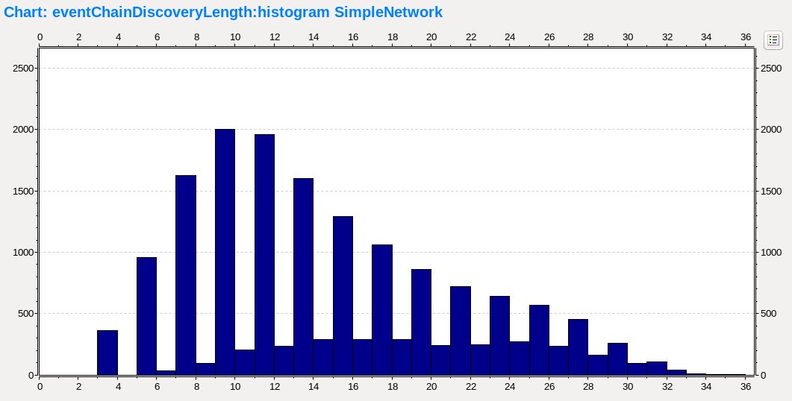

The histogram of the simulation time needed to complete the event order discoveries for
all nodes is somewhat similar to the event bounds discoveries. The main difference comes
from the fact, that each event order discovery requires two distinct event chain
discoveries to be carried out:

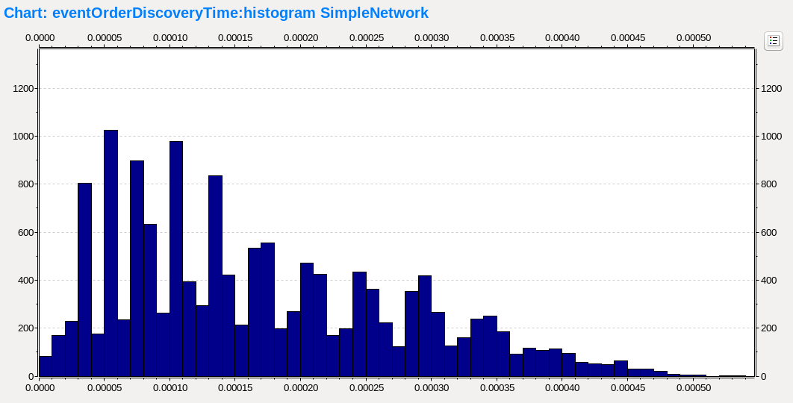

It's also important to verify that the actual order of two randomly chosen events are as
balanced as expected. This chart shows the balance is correct, the relation goes as often
in one way (-1 values) as it goes in the other (+1 values). The relatively small number of
cases, where the relationship is undefined (0 values), is caused by the two discovered
event chains being overlapping, thus not giving a definite answer.

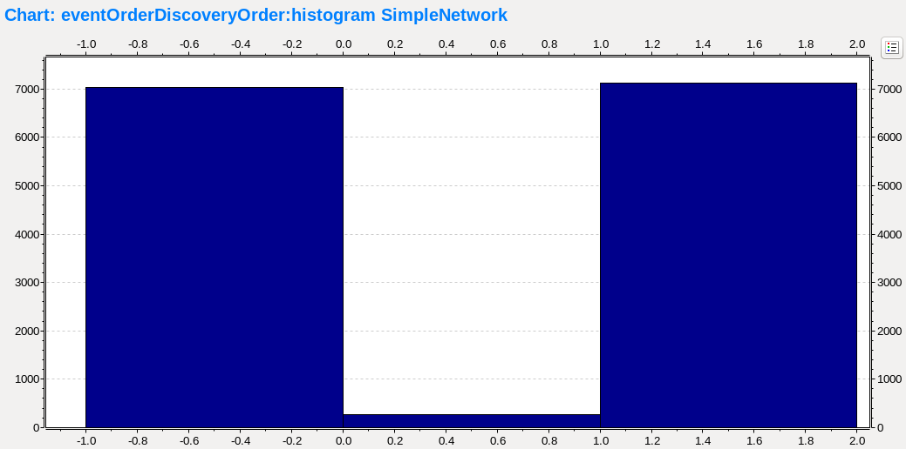

The next chart shows the number of UDP packets sent by each node separately. There are
quite big differences between the nodes, because the network topology is asymmetric:

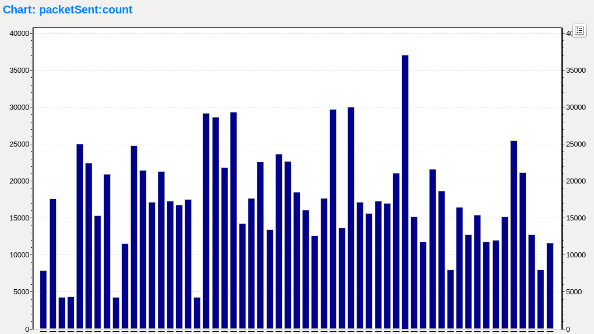

The histogram of all UDP packet lengths may also be of interest. Unfortunately, this chart
is barely useful, because the packet length is dominated by the clock event notifications
(many small packets):

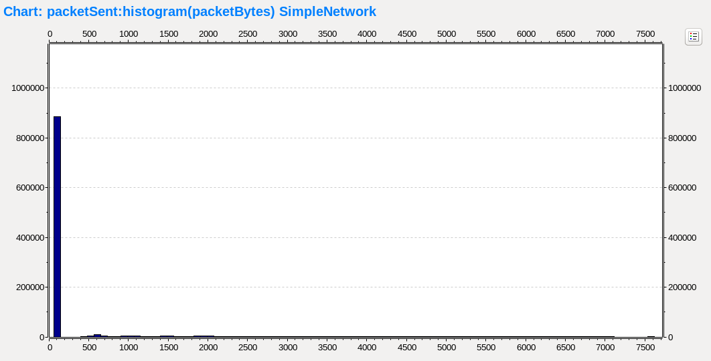

But zooming in to the actual discovery packets region reveals the true distribution of the
size of event chain discovery response packets. These are the packets which carry the
useful data back to the discovery originator:

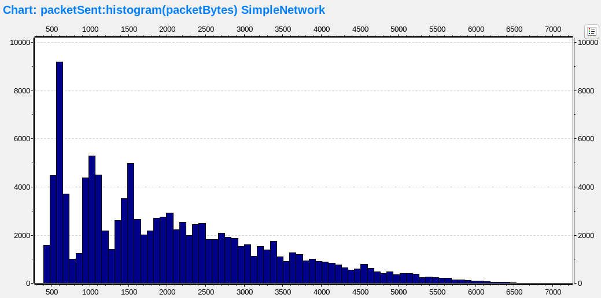
